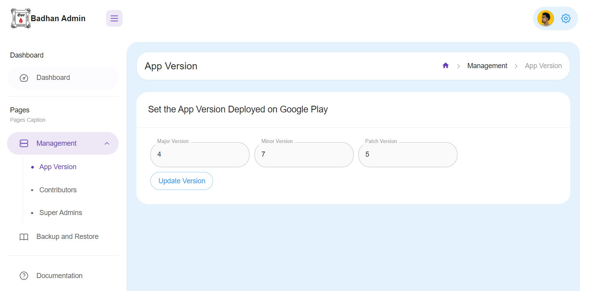
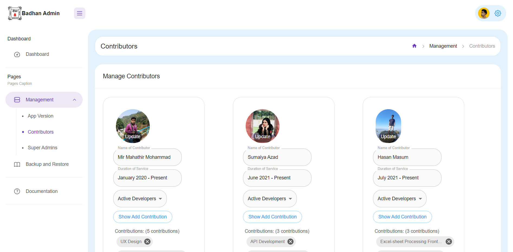
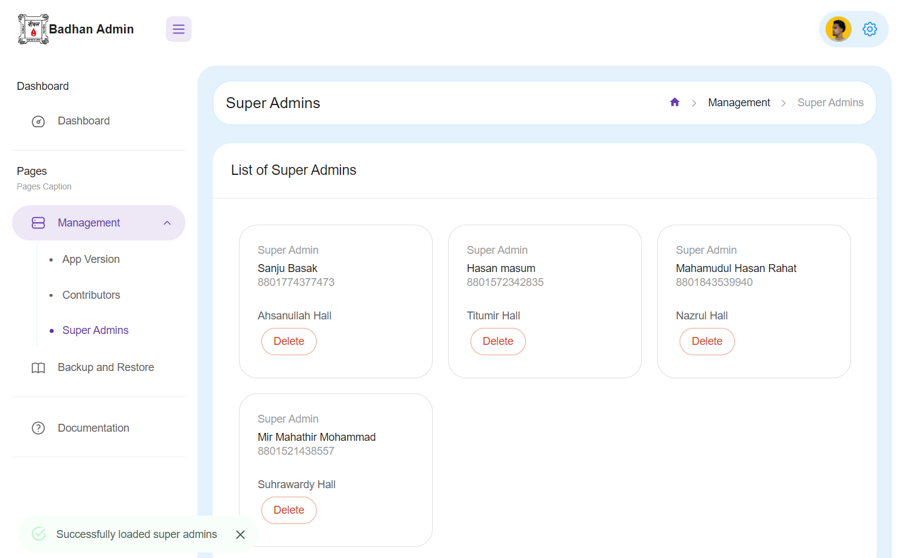
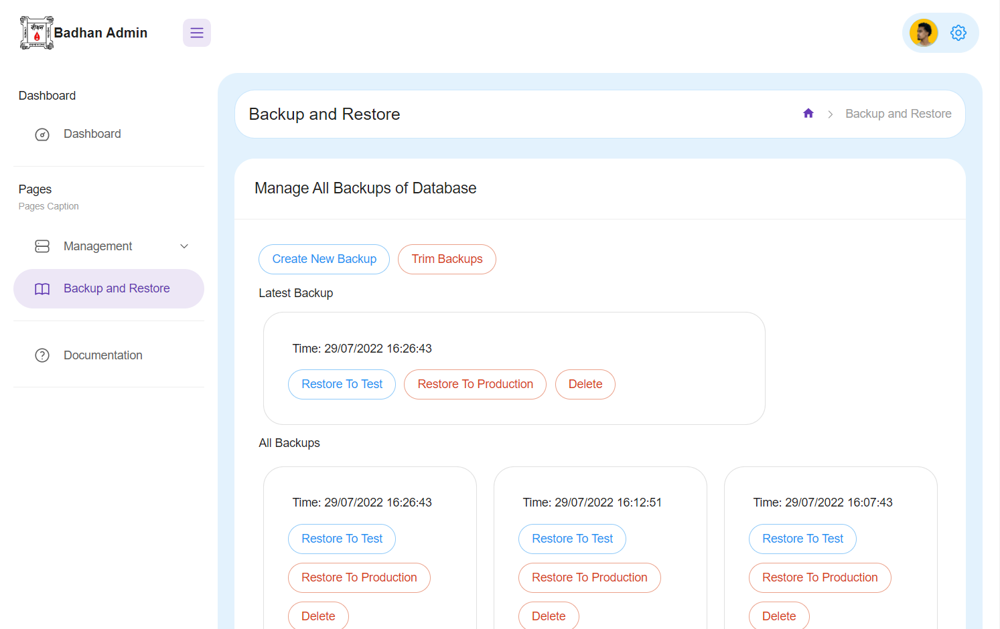

# Overview
Badhan Admin Console Website is an extension of the main Badhan, BUET Zone Android app that manages operations accessible by the Super Admins of this platform. This website consists of two repositories: 
1) Frontend (https://github.com/Badhan-BUET-Zone/badhan-admin-frontend)
2) Backend (https://github.com/Badhan-BUET-Zone/badhan-admin-api)

This website can be visited by any one of the following links:
* Direct Login (https://badhan-admin.web.app/)
* Secure Redirection from app (https://badhan-buet.web.app/#/adminconsole)

# Features
## Version

https://badhan-admin.web.app/management/version

- To send notification to the general user of the app if a new version of the app is available in Google Play Store

## Contributors

https://badhan-admin.web.app/management/contributors

- To manage the list of contributors shown in the Credits page of the app
## Super Admins

https://badhan-admin.web.app/management/superadmin

- To add or remove super admins of the platform

## Backup and Restore

https://badhan-admin.web.app/backup-restore

- To backup and restore the MongoDB database of the whole platform

# Setup Backup and Restore
The Backup-and-Restore page is a UI for the API implemented in [this repository](https://github.com/Badhan-BUET-Zone/badhan-backup). 
However, this API has not been deployed to a live server and this, you will need to 
follow through the instructions written below in order to run the API locally in your
machine.
1) Install Node.js on your machine
2) Clone [this repository](https://github.com/Badhan-BUET-Zone/badhan-backup). To do this, run `git clone https://github.com/Badhan-BUET-Zone/badhan-backup`
3) Enter into the directory and install all dependencies. Run `cd badhan-backup` and `npm i`
4) Download the contents of [this link](https://drive.google.com/drive/folders/13SFt1fY0XPAe9p1xkWN2gCLQzvbHx0y7?usp=sharing) and put these files inside the `bin` folder of the cloned repo.
5) Get `badhan-buet-1d20b088a755.json` and `config.env` files from me (mirmahathir1@gmail.com). Paste them inside the `config` folder of the cloned repository.
6) Run `npm start` inside the repo.
7) Go to https://badhan-admin.web.app/backup-restore

You should now see the Backup-and-Restore page
